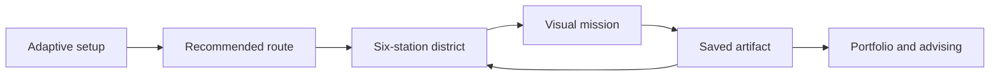

<p align="center">
  
</p>

<h1 align="center">Navigate the Pathway</h1>

<p align="center">
  A phone-first, media-first learning experience for premedical juniors and seniors.
</p>

<p align="center">
  <a href="https://manyweather.github.io/navigate-the-pathway/"><strong>Open the live prototype</strong></a>
  &nbsp;|&nbsp;
  <a href="docs/spec/PRODUCT_AND_SOFTWARE_SPECIFICATION.md">Read the product specification</a>
</p>

<p align="center">
  <a href="https://github.com/Manyweather/navigate-the-pathway/actions/workflows/ci.yml"></a>
  
  
</p>

## What students experience

Students begin with a brief adaptive setup, explore a visual district, complete short missions, save application-ready evidence, and return to a map that reflects their progress. Rosie the Roadrunner offers guidance without turning the experience into a points competition.

| Explore | Practice | Prepare |
| --- | --- | --- |
| Six open stations, a pilot checklist, and eight recommended starting routes | Visual stations, tap-through diagrams, attendance practice, survey shells, and reflection prompts | Portfolio documents, Story Studio, advising packets, and application-note export |
| Phone-first map, four-destination dock, and quick capture | Low-pressure cohort participation and support mapping | Student-selected sharing with expiration and revocation controls |

## The six-station district

- **Course Camp:** courses, questions, follow-up plans, and study strategies
- **Experience Vault:** quick capture, detailed experiences, hours, moments, and revisions
- **Compassion Commons:** service, context, barriers, compassionate responses, and reflection
- **Cohort Commons:** community participation and support-network building
- **Reflection Studio:** reflection, story building, and evidence development
- **Application Outlook:** advising preparation, Portfolio review, and application export

Every station stays available. Recommendations identify a useful next destination without points, rankings, streak pressure, or locked content.

## Media-first design

- Short screens with one clear action
- Rosie poses for welcome, privacy, recommendations, saved work, and returning moments
- [Rosie speech and HeyGen script review](docs/content/ROSIE_SPEECH_HEYGEN_REVIEW.md) for narration approval before voice production
- Muted autoplay-once media with captions, transcript, replay, skip, and poster fallbacks
- Touch, mouse, and keyboard support across phone, tablet, and desktop layouts
- Reduced-motion behavior and accessibility text for visual content

## Demonstration boundaries

This is a fictional, browser-local product demonstration. It is not an admissions portal or admissions decision tool.

- Student-created entries stay on the current device.
- Route recommendations never use GPA, MCAT, demographics, personality labels, or message volume.
- Reviewer views use fictional records and expose only active, student-selected packet items.
- No student accounts, institutional authentication, Supabase, D1, email, analytics, or external message delivery are active.
- No real student, patient, research-participant, admissions, or advising records should be entered.

The GitHub Pages prototype uses a shared playtest access gate backed by a Cloudflare Worker. Access-code comparison and session signing happen at the edge, and secrets are never stored in GitHub or the browser bundle. The static application files remain public, so this is a playtest gate rather than institutional authentication.

## Architecture at a glance



The current prototype uses the versioned browser-local state key `navigate.pathway.demo.v2`, with one-time recovery from the earlier unified, donor, and media-first formats. The SQL under [`docs/architecture/`](docs/architecture/) is future architecture reference material only and is not imported by the application.

The earlier Sites deployment remains available as a rollback while GitHub Pages is the primary student-facing address.

## Local development

Requirements: Node 22.13 or newer and pnpm.

```bash
pnpm install
pnpm dev
```

For local access-gate testing, create an ignored `.env.local` containing `NAVIGATE_ACCESS_CODE` and a separate high-entropy `NAVIGATE_SESSION_SECRET`. Never commit real playtest credentials.

Run the verification suite with:

```bash
pnpm lint
pnpm test
```

## Repository guide

- [`app/journey-experience.tsx`](app/journey-experience.tsx): media-first student district and missions
- [`app/components/feature-workspaces.tsx`](app/components/feature-workspaces.tsx): station routing and reviewer views
- [`app/components/pilot-workspaces.tsx`](app/components/pilot-workspaces.tsx): attendance, survey, curriculum, course-snapshot, Portfolio, advisor, and admin pilot workflows
- [`app/curriculum-data.ts`](app/curriculum-data.ts): transcribed 2025-2026 curriculum references and review annotations
- [`app/prototype-store.tsx`](app/prototype-store.tsx): state, persistence, and legacy migrations
- [`app/access-session.ts`](app/access-session.ts): constant-time code comparison and signed session cookies
- [`docs/spec/`](docs/spec/): product, playtest, architecture, and v0.2 handoff specifications
- [`docs/content/AAMC_2027_ORGANIZATION_GUIDANCE.md`](docs/content/AAMC_2027_ORGANIZATION_GUIDANCE.md): coursework and experience organization mapped from the 2027 AMCAS guide
- [`docs/architecture/supabase-schema.sql`](docs/architecture/supabase-schema.sql): dormant production architecture reference
- [`docs/architecture/PILOT_DEMO_ARCHITECTURE.md`](docs/architecture/PILOT_DEMO_ARCHITECTURE.md): current safety boundary, migration, production gaps, and unresolved decisions

The preserved media-first visual baseline is tagged [`frontend-media-v4`](https://github.com/Manyweather/navigate-the-pathway/releases/tag/frontend-media-v4).

## Licensing

No open-source license is included. Roseman University must approve a licensing position before one is added.
