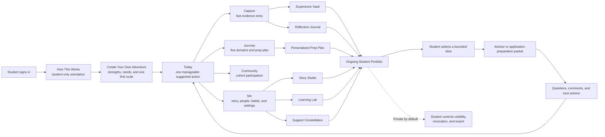
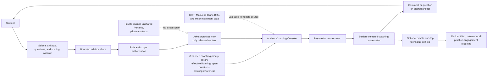
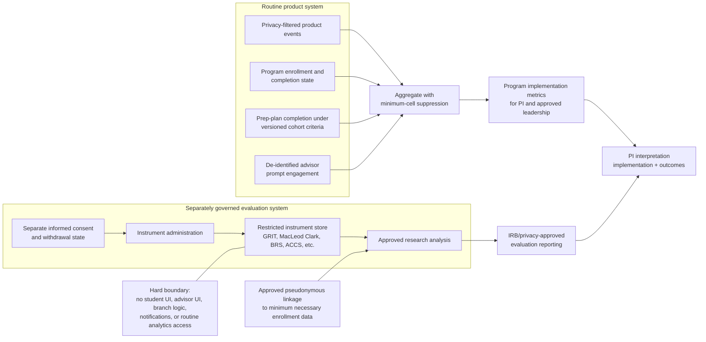
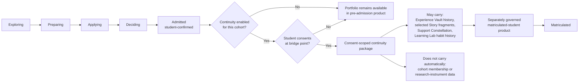
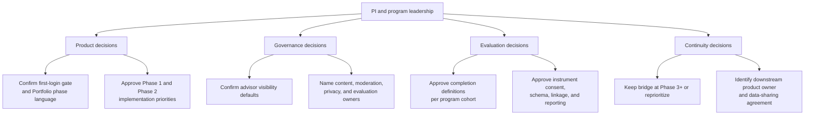

# Navigate the Pathway — PI Architecture Views

**Version:** 0.2
**Audience:** Principal investigator, program leadership, advisors, privacy/IRB stakeholders, and implementation partners
**Purpose:** Show how the product works from the student, advisor, evaluation, and longitudinal-continuity perspectives.

---

## 1. Student user architecture

This view shows how a student moves from orientation to one useful action, how source records become a living Portfolio, and how the student controls any outward sharing.

### What this architecture communicates

- The Portfolio is assembled from source records; it is not a second copy of the student's data.
- The product reduces complexity through **Today**, while the full ecosystem remains available.
- The student shares a bounded purpose-specific packet, never the whole Portfolio by default.
- Advisor feedback returns to the student's own next-action loop rather than becoming an admissions judgment.

---

## 2. Advisor user architecture

This view shows how advisors coach from information a student intentionally shared, with contextual technique prompts and without access to private or research-governed data.

### What this architecture communicates

- Advisor access begins with an explicit student share and ends at the scope of that share.
- The console coaches the advisor's technique; it does not score the student or the advisor.
- Private journal content, unshared Portfolio content, private contacts, and validated instrument data never enter the advisor view.
- Practice logs are advisor-private and become program data only through de-identification and minimum-cell aggregation.

---

## 3. Program evaluation and research-data architecture

This view separates routine product improvement from consented research measurement. It is the most important governance diagram for PI, privacy, and IRB discussions.

### What this architecture communicates

- Product metrics answer whether the program was used and completed as designed.
- Validated instruments answer research questions under separate consent and governance.
- The two streams may meet only through an approved, minimum-necessary, pseudonymous analysis process.
- Instrument scores are not coaching inputs and are never rendered to students or advisors.

---

## 4. Longitudinal continuity architecture

This view shows how the Pathway can extend beyond admission without making post-admission continuity an MVP promise.

### What this architecture communicates

- Phase labels describe orientation to the process, not an admissions-readiness score.
- The bridge is disabled by default and begins only after student confirmation, cohort enablement, and explicit consent.
- A downstream owner and data-sharing agreement must exist before implementation.
- Research data remains outside the bridge regardless of student phase.

---

## 5. PI decision architecture

## Recommended PI framing

> Navigate the Pathway is one student-owned evidence ecosystem with purpose-specific views. Students build and control the longitudinal record; advisors coach from bounded shares; program leaders see privacy-protected implementation measures; researchers analyze separately consented instruments; and post-admission continuity occurs only through an explicit, governed bridge.
