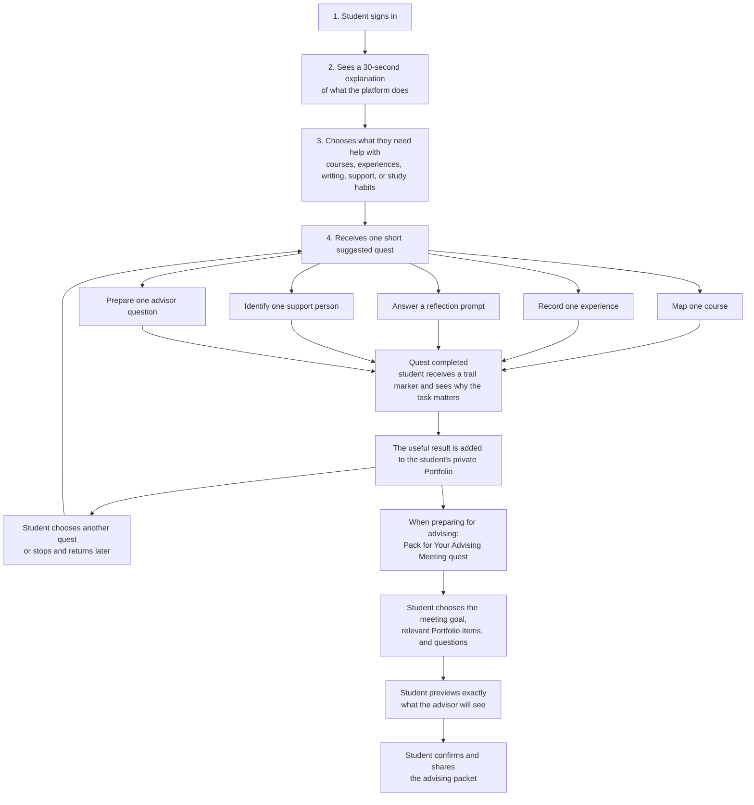
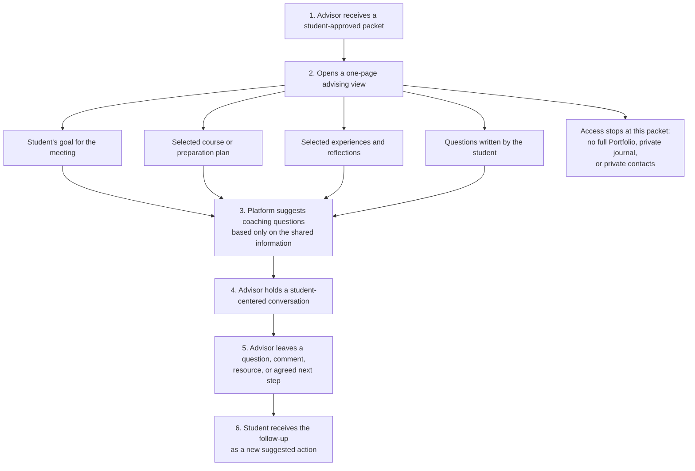

# Navigate the Pathway — Student and Advisor Overview

**A plain-language introduction for a principal investigator or program leader**

## What is Navigate the Pathway?

Navigate the Pathway is a phone-first, game-informed platform for college juniors and seniors preparing for medical school. It helps students keep track of courses and experiences, reflect on what they are learning, prepare questions for advisors, and gradually build useful application material.

The platform does not predict admission or rank students. Its game elements are short **quests**, trail markers, progress through a personal map, and encouraging feedback for completing meaningful preparation tasks. There are no public leaderboards and students do not earn points simply for accumulating hours.

## Plain-language definitions

- **Suggested next action:** one small, realistic task the student can complete now, based on their goal and available time. Examples include mapping one course, recording one experience, writing a short reflection, identifying one support person, or preparing one advisor question. This replaces the phrase “humane next move.”
- **Quest:** a guided activity that breaks one preparation task into a few short steps and produces something useful for the student.
- **Portfolio:** the student's private, living record of their course plan, experiences, reflections, learning strategies, support network, selected story ideas, and next steps. It grows as the student completes quests.
- **Advising packet:** a small, purpose-specific selection from the Portfolio that the student chooses to share for one advising conversation. It is not the student's full account.

---

## 1. How a student uses the platform

### What the student sees

- **Today:** one suggested quest and why it may help.
- **Journey:** a visual map of courses, experiences, application preparation, learning habits, support, and developing professional identity.
- **Capture:** a quick way to record an experience, hours, a reflection, a person, or an idea before the details are forgotten.
- **Community:** structured ways to observe, ask for help, offer help, join a study group, or celebrate progress with a cohort.
- **Me:** the student's Portfolio, story ideas, learning-strategy experiments, support network, privacy settings, and exports.

### How the Portfolio grows through play

A quest always creates a useful result rather than awarding points for activity alone. For example:

1. **Recover the Evidence** asks the student to record what they did, when they did it, who was involved, and what stayed with them.
2. The student receives a trail marker for completing the reflection—not for reporting a high number of hours.
3. The experience and reflection appear in the private Portfolio.
4. The platform explains that this record can later support an advisor conversation, an activity description, or a personal story.
5. A future quest may invite the student to revisit the same entry and add what they understand differently now.

Sharing is also guided as a quest, but it is never automatic. **Pack for Your Advising Meeting** asks the student to:

1. choose what they want help with;
2. select only the relevant Portfolio items;
3. add the questions they want to discuss;
4. preview the advisor's view; and
5. confirm who can see it and for how long.

---

## 2. How an advisor uses the platform

### What the advisor sees

The advisor sees only what the student selected for that conversation, potentially including:

- the student's stated meeting goal;
- target application cycle or “still exploring”;
- selected course-planning questions;
- selected experiences and reflections;
- selected preparation-plan actions; and
- questions the student wants help answering.

The platform may place a coaching prompt beside the shared material. For example:

- If a student is unsure whether a course meets a requirement: **“What information would help you feel confident about the next step?”**
- If an experience entry lists tasks but little reflection: **“What changed in your understanding because of this experience?”**
- If the student reports feeling overloaded: **“Which part of this plan feels realistic right now, and what could be reduced?”**

The advisor can comment or ask questions but cannot rewrite the student's work. The platform does not show an admissions-readiness score, personality score, research-instrument score, or prediction of admission.

---

## Ready-to-send blurb

**Subject: Student and advisor experience for Navigate the Pathway**

I am developing **Navigate the Pathway**, a phone-first, game-informed platform for college juniors and seniors preparing for medical school. The goal is to help students turn scattered courses, experiences, reflections, learning habits, and support relationships into an organized record they can actually use in advising and later application preparation.

Students begin by choosing what they need help with and receive one short, manageable “quest,” such as mapping a course, recording an experience, reflecting on what they learned, or preparing a question for an advisor. Completing a quest adds something useful to a private, living **Portfolio** and shows the student why that task matters. The game layer provides structure, trail markers, and encouraging feedback; it does not rank students or reward them simply for accumulating hours.

When a student wants advising help, a **Pack for Your Advising Meeting** quest guides them through choosing a meeting goal, selecting only the relevant Portfolio items, adding their questions, previewing the advisor's view, and confirming the share. The advisor receives a focused one-page packet rather than access to the student's full account. The platform can then suggest open-ended coaching questions based on the information the student chose to share. Advisor feedback returns to the student as a clear follow-up action.

The two attached architecture diagrams show this student and advisor experience in simple terms.
