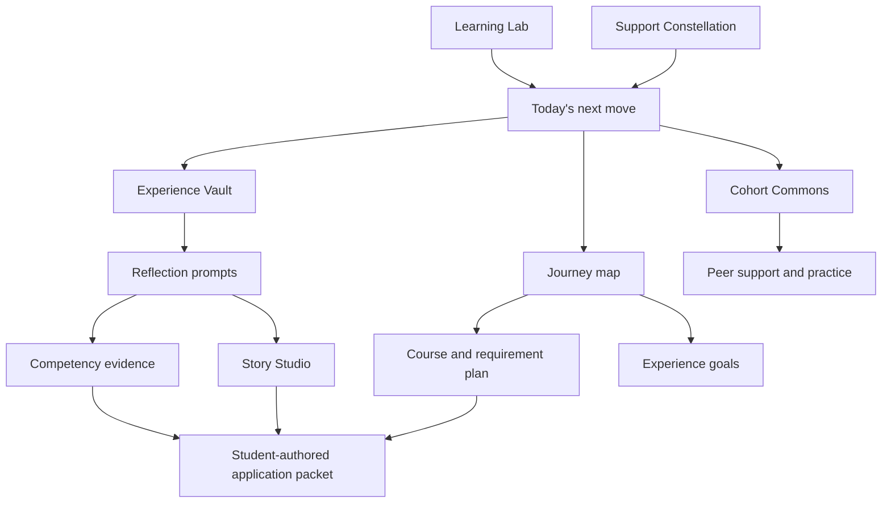
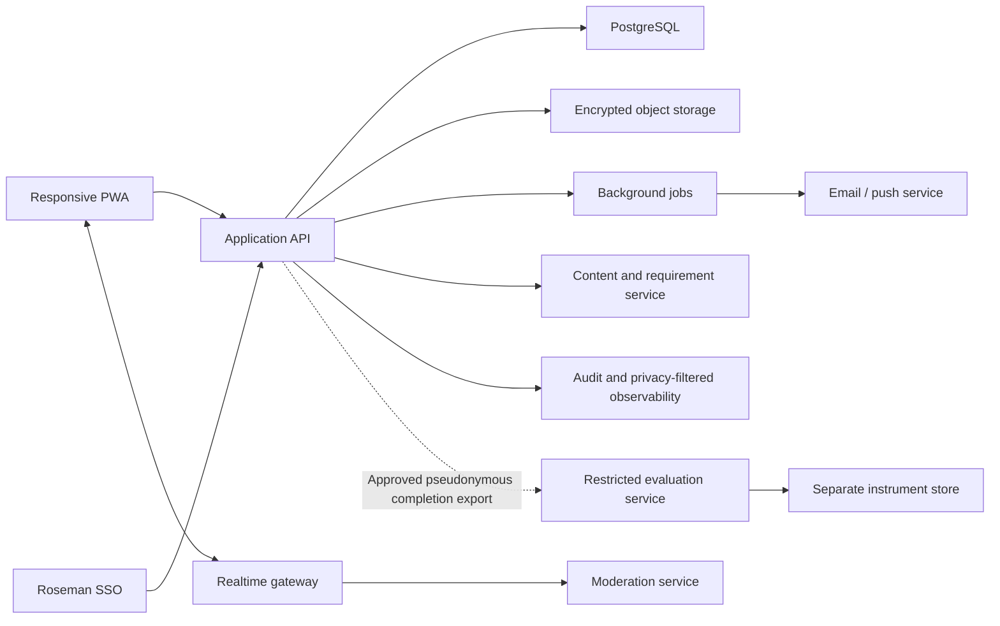

# Navigate the Pathway

## Product and Software Specification

**Working title:** Navigate the Pathway (NtP)
**Version:** 0.2 integrated specification
**Date:** 2026-08-06
**Primary audience:** College juniors and seniors preparing for medical-school application
**Primary platform:** Phone-first responsive web application / progressive web app (PWA)
**Status:** Working specification for stakeholder review, student co-design, and technical estimation

---

## 1. Executive decision

Navigate the Pathway should be a longitudinal formation platform, not a checklist with a game skin and not an admissions predictor.

Its central promise is:

> I can see how what I am doing now becomes evidence of who I am becoming, what I still need to do, and who can help me do it.

The product should help a student:

1. Capture coursework, experiences, hours, responsibilities, and reflections while details are still fresh.
2. Connect those records to competencies, values, relationships, and future application material.
3. Practice the learning and self-regulation habits that will be required in medical school.
4. Participate in a supportive cohort without rewarding competition, extroversion, or performative busyness.
5. Recognize and strengthen a support network before the demands of application and medical training intensify.
6. Build an honest application-ready evidence bank without claiming that any score, badge, or completion state predicts admission.

The first release should make one relationship immediately visible:

> **Experience -> reflection -> competency evidence -> story -> application readiness.**

That relationship is the core educational mechanic of the platform.

---

## 2. Source hierarchy and scope boundary

### 2.1 Sources used

This specification uses the following hierarchy:

1. **Current official Roseman College of Medicine admissions pages** for changeable requirements, deadlines, policies, and contact information.
2. **Roseman University College of Medicine 2024-2025 Admissions Guide** for program identity, holistic admissions framing, prerequisite structure, the Roseman Readiness Curriculum, GENESIS, student support, and the four program commitments: Transforming Education, Embracing Discovery, Reimagining Healthcare, and Committed to Community.
3. **Current AAMC guidance** for application structure, Work/Activities framing, premed competencies, personal-statement authorship, and application preparation.
4. **Prior Navigate product artifacts** only for proven interaction principles: warm tone, non-punitive feedback, visible purpose, reflection, wellbeing, and social support.

The post-admission **Levels Planner is explicitly excluded**. These learners have not been admitted and should not be routed through medical-school curricular weeks.

### 2.2 Content freshness rule

Requirements and dates must never be embedded in application code or narrative copy. They must be versioned content records with:

- source URL;
- effective application cycle;
- last verified date;
- verifying owner;
- required, preferred, or informational status; and
- a visible student-facing freshness label.

The 2024-2025 guide is a design and institutional source, not the source of current deadlines. The current official admissions site controls when facts conflict.

### 2.3 What this product is not

Navigate the Pathway is not:

- the AMCAS application;
- an official admissions decision tool;
- a guarantee of eligibility, interview, acceptance, or success;
- a replacement for a prehealth advisor, learning specialist, counselor, or financial-aid professional;
- a GPA, MCAT, or admissions-probability calculator;
- a clinical-record system;
- a mental-health diagnostic or treatment tool;
- a public social network; or
- a place to store patient names, patient identifiers, protected health information, or confidential research-participant information.

### 2.4 Initial Roseman admissions catalog

The first content catalog should be seeded from the attached admissions guide and reconciled with the current official MD admissions page. The following baseline was verified on 2026-08-05 and must still be stored as editable, cycle-aware content rather than code.

**Current required prerequisites with a passing grade**

| Area | Current requirement |
| --- | --- |
| Biochemistry | 1 semester |
| Social Sciences | 1 semester |
| Statistics | 1 semester |
| Biology | 2 semesters |
| Humanities | 2 semesters |
| Inorganic Chemistry | 2 semesters |

**Current preferred coursework with a passing grade**

Anatomy, Behavioral Sciences, Bioethics, English, Genetics, Mathematics, Organic Chemistry, Physics, Physiology, and Population Health.

**Other current application components to represent**

- baccalaureate degree or higher from an accredited United States or Canadian college or university before matriculation;
- valid MCAT score under the current age policy;
- AMCAS primary application;
- minimum and maximum letter counts with current guidance;
- selected secondary application;
- interview stage;
- current citizenship/residency and prior-enrollment policies;
- technical standards acknowledgment; and
- official dates for the selected application cycle.

The student experience should make a strong visual distinction between **required**, **preferred**, **policy**, **deadline**, and **student planning note**. Meeting displayed requirements must never be described as guaranteeing admission or advancement.

### 2.5 Initial application-alignment catalog

The application-preparation layer should use a versioned AMCAS schema. As of the 2027 application materials available in 2026, the product should be able to represent up to 15 Work/Activities experiences, recurring occurrences, completed and anticipated hours, up to three experiences identified as most meaningful, and cycle-specific plain-text character limits. These limits belong in content/configuration records so they can change by cycle.

The platform should also seed the current AAMC Premed Competencies as a reflective taxonomy. Students may link evidence to competencies, but the system does not certify that a student possesses a competency and does not convert those links into an admissions score.

---

## 3. Product vision and outcomes

### 3.1 North-star outcome

Students move from fragmented activity accumulation to coherent, reflective preparation for medical school.

### 3.2 Student outcomes

By the end of a junior-to-senior journey, a student should be able to:

- explain the current prerequisite plan and identify questions for an advisor;
- maintain an accurate, editable record of completed and anticipated experiences and hours;
- explain what they learned, how they changed, whom they served, and what impact they had;
- identify repeated themes that may inform Work/Activities entries and a personal statement;
- demonstrate learning strategies through repeated plan-practice-reflect-adjust cycles;
- name and activate academic, personal, peer, and professional support people;
- participate in cohort life through a mode that fits their current confidence and energy;
- connect their preparation to empathy, humility, respect, excellence, service, advocacy, collaboration, and community health; and
- export a student-authored application-preparation packet.

### 3.3 Program outcomes

The program should be able to:

- see aggregate, privacy-protected patterns in where students need support;
- detect friction early enough to offer resources without labeling students as deficient;
- increase meaningful advising conversations;
- strengthen cohort belonging and peer help-seeking;
- evaluate whether students understand the value of reflection and longitudinal documentation; and
- improve the completeness and usefulness of students' application-preparation materials.

### 3.4 Non-outcomes

The system must not optimize for:

- maximum hours;
- maximum posts or reactions;
- daily login streaks at the expense of rest;
- public ranking;
- application sameness;
- automated judgments of compassion, introversion, personality, or admission likelihood; or
- replacing authentic student voice with generated prose.

### 3.5 Goal-to-product traceability

| Stated goal | Primary product response | Evidence of success |
| --- | --- | --- |
| Track prerequisites, service, research, clinical work, and other experiences | Journey Map + Experience Vault | Current, source-linked plan and accurate longitudinal records. |
| Build application material incrementally | Reflection Journal + Story Studio + Application Packet | Student can move from a real experience to a student-authored draft without re-creating lost details. |
| Cultivate cohort-ship and peer support | Cohort Commons + cooperative quests + study pods | Students ask, offer, respond, and connect across multiple participation modes. |
| Identify and coach quieter students | Self-selected participation ladder + scripts + small-group roles | Students report greater participation self-efficacy without being labeled or ranked. |
| Teach the product with minimal presenter instruction | Create Your Own Adventure onboarding | Students independently create an artifact and explain why tracking plus reflection matters. |
| Build medical-school-ready learning habits | Learning Lab | Students run, evaluate, and adjust learning-strategy experiments. |
| Carry Roseman values through the experience | Value-aligned mechanics and reflection prompts | Students encounter humility, excellence, respect, service, discovery, and community as actions, not slogans. |
| Make the platform an interconnected ecosystem | Shared evidence model across Journey, Capture, Story, Learning, Support, and Community | A single artifact can inform reflection, advising, goal-setting, competency evidence, and application preparation. |

---

## 4. Roseman through-lines

The platform should not merely display Roseman values on an About screen. Its mechanics should enact them.

| Institutional through-line | Product behavior |
| --- | --- |
| **Humility** | Reflection prompts ask what the student did not know, what they learned from others, and whose perspective is missing. Feedback never treats hours as proof of virtue. |
| **Excellence** | Students set clear standards, receive specific feedback, revisit incomplete work, and improve artifacts over time. Excellence is growth toward a standard, not winning against peers. |
| **Respect** | Students control visibility, choose participation modes, use names and pronouns correctly, and practice consent and dignity in community interactions. |
| **Transforming Education** | The product makes learning strategies visible, gives rapid feedback, and lets students revise plans and artifacts. |
| **Embracing Discovery** | Research and curiosity are represented as question-forming, evidence-seeking, iteration, and learning from uncertainty. |
| **Reimagining Healthcare** | Experiences are connected to social, economic, environmental, technological, and ethical contexts rather than reduced to clinical exposure alone. |
| **Committed to Community** | Service reflection centers reciprocity, community priorities, continuity, advocacy, and impact rather than resume accumulation. |
| **Mastery learning** | The core cycle is detect -> correct -> retry -> reflect. No punitive first-attempt scoring. |
| **Active and collaborative learning** | Cohort quests require contribution and mutual support without public competition. |
| **Early experiential learning** | The product treats current service, research, work, shadowing, leadership, and caregiving as opportunities to practice observation and reflection now. |
| **Holistic review** | The platform represents experiences, attributes, learning, context, and academic preparation as an interconnected evidence set, not a single readiness number. |

### Design language

Use the Roseman idea that the heart and science of healthcare belong together:

- **Heart:** empathy, service, respect, relationships, community, reflection.
- **Science:** coursework, inquiry, evidence, learning strategies, analysis, reliability.
- **Bridge:** the student's ability to make meaning, adapt, communicate, and act with others.

### 4.1 Mirroring medical-school demands without pretending students are already medical students

The platform prepares students through analogous habits, not medical-school curricular levels.

| Future demand | Premed practice inside the platform |
| --- | --- |
| High information volume | Choose priorities, plan realistic work, retrieve, space, and adjust strategies. |
| Frequent feedback and reassessment | Detect a gap, correct it, retry, and document what changed. |
| Ambiguity and changing conditions | Re-plan when time, opportunity, or goals change without treating the change as failure. |
| Team-based learning and care | Ask for help, explain reasoning, offer support, and contribute through varied roles. |
| Professional communication | Practice questions, feedback requests, boundaries, follow-through, and respectful disagreement. |
| Patient- and community-centered thinking | Reflect on context, access, social determinants, reciprocity, and missing perspectives. |
| Professional identity formation | Connect experiences to values and actions while preserving uncertainty and growth. |
| Sustained wellbeing | Build a support constellation, protect recovery, and use institutional resources early. |

---

## 5. Audience and jobs to be done

### 5.1 Primary users

- College junior who is early in planning and unsure what counts.
- College senior who has experience but incomplete documentation.
- Academically strong student with limited clinical or service exploration.
- Service-rich student who has not translated experience into reflection or narrative.
- Research-focused student who needs broader human and community context.
- Quiet or introverted student who wants connection but finds unstructured participation costly.
- Working, caregiving, commuting, first-generation, transfer, or nontraditional student with limited discretionary time.
- Student targeting the current application cycle and needing a clear transition to AMCAS preparation.

### 5.2 Secondary users

- Learning specialist or academic advisor.
- Premed program coordinator.
- Cohort facilitator or trained peer mentor.
- Community moderator.
- Admissions/content owner who maintains public requirement information but does not evaluate participating students.
- Institutional administrator responsible for privacy, accessibility, security, and reporting.

### 5.3 Student jobs to be done

When I finish an experience, help me capture what happened before I forget.

When I wonder whether an activity matters, help me identify learning, responsibility, impact, and growth without telling me what admissions will think.

When my preparation is uneven, show me one manageable next move rather than a wall of deficits.

When I am overwhelmed, help me reduce the plan, protect my wellbeing, and contact the right person.

When I am hesitant to speak, give me a lower-risk way to contribute and a clear path to greater participation if I want it.

When I prepare application materials, help me find my own evidence and words rather than writing my story for me.

---

## 6. Dual-lens design matrix

| Product area | Student-development lens | Learning-specialist lens |
| --- | --- | --- |
| Journey map | Builds agency, purpose, identity, and future orientation. | Makes goals, prerequisites, dependencies, and next actions visible. |
| Experience vault | Validates paid work, caregiving, leadership, research, service, and lived experience. | Uses timely retrieval and structured encoding to improve later recall. |
| Reflection | Supports meaning-making, ethical awareness, empathy, and narrative identity. | Uses prompts, feedback, and spaced revisiting to deepen metacognition. |
| Cohort commons | Builds belonging, reciprocity, peer support, and help-seeking norms. | Enables social learning, explanation, feedback, and accountability. |
| Quiet participation pathway | Respects temperament, culture, disability, language, and confidence. | Uses graduated practice, scripts, rehearsal, and choice to reduce avoidable cognitive load. |
| Study laboratory | Builds sustainable habits and self-efficacy. | Uses retrieval, spacing, interleaving, exam wrappers, implementation intentions, and self-monitoring. |
| Story studio | Develops authentic voice and professional identity. | Uses evidence sorting, comparison, elaboration, revision, and feedback. |
| Support constellation | Makes interdependence a strength rather than a rescue state. | Externalizes who can provide emotional, informational, academic, and practical support. |
| Gamification | Provides momentum, celebration, and exploration. | Reinforces meaningful behaviors and reflection rather than vanity metrics. |

---

## 7. Information architecture

### 7.1 Student navigation

The phone experience uses a five-item bottom navigation:

1. **Today** - one recommended action, one reflection or check-in, and one cohort signal.
2. **Journey** - prerequisite map, experience landscape, milestones, and application-cycle view.
3. **Capture** - fast entry for an experience, hour block, reflection, person, idea, or artifact.
4. **Community** - cohort channels, structured asks/offers, study pods, events, and peer quests.
5. **Me** - Story Studio, Support Constellation, Learning Lab, privacy, exports, and preferences.

On tablet and desktop, the same objects appear in a wider two- or three-pane layout. No essential function exists only on hover or only in a desktop sidebar.

### 7.2 Core ecosystem

### 7.3 Readiness domains

The Journey view shows five separate, descriptive domains. They must not be collapsed into one score.

1. **Academic foundation** - required and preferred coursework plan, completion state, questions, and source freshness.
2. **Meaningful engagement** - continuity, responsibility, context, and reflection across service, clinical exposure, research, leadership, work, caregiving, and other significant experiences.
3. **Learning adaptability** - evidence of planning, feedback use, strategy experiments, recovery, and adjustment.
4. **Community and support** - peer connection, mentoring, help-seeking, and support-system awareness.
5. **Emerging physician identity** - themes involving empathy, compassion, humility, ethics, communication, service, advocacy, inquiry, and responsibility.

Each domain uses states such as **Not mapped**, **In progress**, **Ready to discuss**, and **Revisit**, not red/yellow/green admissions judgments.

---

## 8. First-login Create Your Own Adventure

### 8.0 Startup “How This Works”

This short, static orientation appears before the personalized Create Your Own Adventure (CYOA). It explains the product without previewing the branches or replacing the discovery built into the interactive flow.

#### 8.0.1 Placement and access

- Show it automatically on the first authenticated student launch, before the CYOA inventory.
- Make it permanently available from **Me -> How this works**.
- Never show it to advisors, facilitators, moderators, administrators, or other non-student roles.
- Allow students to skip after Card 1 without blocking account setup, CYOA, or any other function.
- Store the card content in the versioned content-management system rather than application code.

#### 8.0.2 Phone-first card content

**Card 1 - What this is**

> Navigate the Pathway helps you turn what you're already doing — classes, work, service, research, caregiving, whatever it is — into a record you can actually use. Not just for one application. For the whole stretch between now and becoming the physician you're working toward.

**Card 2 - What this isn't**

> This doesn't predict admission, score your chances, or replace your advisor. It's a place to keep things accurate and build the story that's actually yours to tell.

**Card 3 - How it's private**

> Everything you write is private by default. You choose what to share, with who, and you can change your mind later. Never enter a patient's name or identifying details about anyone you're not allowed to identify.

**Card 4 - The five places you'll live**

> **Today** for your next move. **Journey** to see the whole map. **Capture** to log something fast. **Community** for your cohort. **Me** for your story, your people, and your settings.

An optional fifth card, **Your record doesn't reset**, may appear only when post-admission continuity is enabled for the student's cohort or tenant. The feature flag is false by default.

#### 8.0.3 Functional requirements

| ID | Requirement |
| --- | --- |
| ORNT-01 | Show the four-card explainer once automatically on first launch, before CYOA begins. |
| ORNT-02 | Make the explainer reachable at any time from Me, with no re-authentication friction. |
| ORNT-03 | Never show this screen, or any variant of it, to non-student roles. |
| ORNT-04 | Skipping at any point after Card 1 must not block or delay account setup or CYOA. |
| ORNT-05 | Card content is CMS-editable and version-controlled like admissions content. |
| ORNT-06 | Card 5 renders only when the cohort or tenant continuity flag is true; the flag defaults to false. |

### 8.1 First-session goal

Within 8-12 minutes and without presenter instruction, every student should:

- understand that experiences are valuable because of learning, contribution, responsibility, growth, and meaning, not merely hours;
- capture at least one real artifact;
- see how that artifact can support later application work;
- receive a personalized next step; and
- know that the platform will change as their journey changes.

### 8.2 Opening message

> You have already started your path to medicine. Let's turn what you have done, learned, and cared about into a map you can use.

The opening must state:

- this is preparation, not an admissions decision tool;
- entries are private by default;
- students must not enter patient identifiers or confidential research information;
- students may skip questions and change answers later; and
- requirements are sourced and date-stamped.

### 8.3 First-session sequence

1. **Choose where you are now**: junior, senior, gap-year planning, or unsure.
2. **Choose a near-term intention**: map courses, capture experiences, strengthen a missing area, build a support system, improve learning habits, or prepare application material.
3. **Quick landscape inventory** using ranges and status chips rather than long forms:
   - required and preferred coursework state;
   - experience types already explored;
   - whether records and reflections exist;
   - target application cycle or unsure;
   - current bandwidth;
   - preferred participation mode; and
   - whether the student can name academic, personal, and professional support people.
4. **Show the starting map** with existing strengths first.
5. **Offer three doors**, one recommended and two student-chosen alternatives.
6. **Complete a five-minute quest** that produces a real artifact.
7. **Reveal the application connection** in plain language.
8. **Commit to one next move** and choose a reminder style.
9. **Optional cohort arrival action**: react to a prompt, post an introduction card, answer a structured question, or simply observe.

### 8.4 Branching rules

Branching personalizes order and scaffolding; it must not hide content or create fixed tracks.

| Signal | Recommended first route | First artifact | Immediate meaning shown |
| --- | --- | --- | --- |
| Required-course plan incomplete or uncertain | **Chart the Route** | One mapped course or one advisor question | “You turned uncertainty into a specific question and next step.” |
| Experiences exist but records are sparse | **Recover the Evidence** | One experience with dates, role, hours, and a short reflection | “This gives future-you accurate material for Work/Activities.” |
| Many hours are logged but little reflection exists | **Find the Story** | One Context-Action-Impact-Meaning-Growth reflection | “Hours show duration; this reflection shows learning and contribution.” |
| Limited exposure in one or more areas | **Explore the Next Door** | One realistic 30-day exploration goal | “A small, sustained next step is more useful than panic activity.” |
| Low participation comfort | **Quiet Start** | Private goal plus an observe/react/respond participation choice | “Connection can begin without performing.” |
| Weak or unclear support network | **Build the Constellation** | Three named support roles and one contact plan | “Medicine is collaborative; preparation should be too.” |
| High overload or low bandwidth | **Make It Sustainable** | One reduced plan and one protected recovery block | “A plan that fits your life is stronger than an abandoned ideal plan.” |
| Application cycle is near | **Assemble the Evidence** | Gap review plus one high-priority artifact | “You now know what is ready, what needs revision, and whom to ask.” |

### 8.5 Branch selection logic

The engine considers:

- student-selected priority;
- time sensitivity;
- missing or stale artifacts;
- prerequisite uncertainty;
- reflection depth;
- support needs;
- current bandwidth; and
- prior quest history.

The engine must not use GPA, MCAT, disability, race, gender, personality classification, message volume, or sentiment to assign a branch.

Recommended branch scoring must be inspectable by product administrators and explainable to students: “We suggested this because you said X and have not yet completed Y.”

---

## 9. Core modules

### 9.1 Today

Purpose: reduce a complex journey to one manageable, realistic action the student can take now.

Required elements:

- one recommended action with “Why this now?”;
- change-action control;
- progress since last visit;
- optional 20-second check-in;
- one cohort signal or event;
- continue-draft affordance; and
- visible access to help.

No screen should show more than three competing primary calls to action on a phone.

### 9.2 Journey Map

Purpose: show how academic preparation, experiences, learning habits, support, and identity development connect over time.

Capabilities:

- target-cycle timeline;
- current official Roseman prerequisite catalog;
- required vs. preferred coursework distinction;
- completed, enrolled, planned, uncertain, and advisor-review states;
- source links and last-verified dates;
- experience landscape by type without quotas;
- milestone dependencies;
- “questions for my advisor” queue;
- alternative route planning when circumstances change; and
- gap-year and “not sure yet” pathways.

The system must use wording such as “needs review” and “not yet mapped,” never “you are unqualified.”

### 9.3 Experience Vault

Purpose: create an accurate longitudinal evidence record.

Each experience record can include:

- title and organization;
- experience type;
- location and mode;
- start and end dates;
- completed and anticipated hours;
- recurrence or occurrences;
- supervisor/mentor name and contact, stored privately;
- role and responsibilities;
- population or community context without identifiable patient data;
- artifacts or verification notes;
- related people and relationships;
- student-selected competencies and values;
- reflection history;
- visibility setting; and
- revision/audit history.

Fast capture must support a 30-second hour log and a 2-minute reflection. Students can deepen it later.

Experience types should cover at minimum:

- community service/volunteer;
- clinical exposure or employment;
- research/lab;
- paid employment;
- leadership;
- teaching/tutoring;
- campus/community organization;
- shadowing;
- advocacy;
- caregiving or significant family responsibility;
- honors/publications/presentations; and
- other significant experience.

The taxonomy must be configurable and mapped to, but not falsely presented as identical to, current AMCAS categories.

### 9.4 Reflection Journal

Purpose: turn events into learning and future evidence.

The journal has three depths:

1. **Quick capture:** What happened? What stayed with you?
2. **Structured reflection:** Context, Action, Impact, Meaning, Growth, Next step.
3. **Deep revisit:** What changed in your understanding? Whose perspective is missing? What tension or uncertainty remains? How will this affect what you do next?

Prompts vary by experience type, but all prompts must avoid manufacturing an “admissions-worthy” answer.

The system should periodically invite a student to revisit old reflections and annotate them rather than overwrite them. Growth is visible in the differences between reflections.

### 9.5 Story Studio

Purpose: help students discover, organize, and write from their own evidence.

Capabilities:

- story-fragment inbox;
- theme board;
- compare two experiences;
- identify repeated values, questions, relationships, and turning points;
- select candidate “most meaningful” experiences;
- assemble evidence cards for Work/Activities drafting;
- personal-statement question sequences;
- character-count view configured by application cycle;
- revision history;
- feedback request to a selected advisor or reviewer; and
- plain-text export.

If generative AI is introduced later, it may:

- ask follow-up questions;
- identify repeated words or themes;
- flag vague claims that lack evidence;
- suggest where clarification may help; and
- proofread student-authored text.

It must not:

- invent experiences, impact, dialogue, hours, or emotions;
- produce a final personal statement on the student's behalf;
- imitate an admissions officer or predict acceptance;
- silently rewrite the student's voice; or
- train external models on student writing.

Every AI-assisted change must be reviewable, reversible, and labeled. The student must affirm authorship before export.

### 9.6 Learning Lab

Purpose: build adaptable learning habits before medical school.

The lab is organized around a repeated cycle:

> Notice -> Choose -> Try -> Check -> Reflect -> Adjust

Habit experiments include:

- retrieval before review;
- spaced revisit planning;
- interleaving related problem types;
- elaboration and self-explanation;
- exam wrappers;
- error logs;
- realistic weekly planning;
- implementation intentions (“If X happens, I will do Y”);
- distraction/environment experiments;
- help-seeking practice;
- sleep, rest, and boundary reflection without health diagnosis; and
- balancing school, work, caregiving, and personal life.

Students run one small experiment at a time. The outcome is not “success/failure”; it is “keep, adjust, or replace.”

### 9.7 Support Constellation

Purpose: make a student's support system visible and actionable.

Roles can include:

- academic advisor;
- learning specialist;
- faculty mentor;
- research mentor;
- clinical or service supervisor;
- peer/study partner;
- family or chosen-family support;
- practical/logistical support;
- financial-aid resource;
- counseling/wellness resource; and
- admissions contact.

The student identifies what each person can help with, preferred contact method, and one next contact. Private personal contacts are not visible to advisors unless explicitly shared.

### 9.8 Cohort Commons

Purpose: create a Discord-like sense of presence and mutual support within an institutionally safe environment.

MVP capabilities:

- cohort channels;
- topic channels;
- threaded replies;
- reactions;
- mentions;
- structured “ask,” “offer,” “study with me,” and “celebrate” post types;
- small study pods;
- events and RSVP;
- facilitator announcements;
- searchable resource posts;
- reporting, blocking, and moderation; and
- granular notification controls.

Direct messages, voice rooms, anonymous posting, and file sharing are out of MVP until moderation, retention, and safeguarding requirements are approved.

Community data must not be used to assess admission readiness, personality, compassion, or program eligibility.

### 9.9 Application Packet

Purpose: give the student portable, editable preparation material.

Exports may include:

- coursework/prerequisite planning report with source dates;
- experience chronology;
- completed and anticipated hour summaries;
- selected reflections;
- competency evidence map;
- Story Studio fragments and drafts;
- letter-writer relationship notes;
- questions for an advisor;
- target-cycle action list; and
- plain-text Work/Activities preparation pages.

The export must say “Preparation document - verify all requirements and entries before submission.”

### 9.10 Ongoing Student Portfolio

Purpose: provide a living, always-current view of what is true about the student's path so far and where they are now. The Portfolio continues across application cycles; the Application Packet is a bounded slice selected from it for a particular purpose.

#### 9.10.1 Relationship to existing artifacts

| Existing artifact | Scope | Portfolio relationship |
| --- | --- | --- |
| Journey Map | Current planning state across five domains | Shows the history of domain states as well as the current state. |
| Experience Vault | Individual experience records | Renders records as one chronological evidence timeline. |
| Story Studio | Drafting workspace | Surfaces student-selected highlights, not the full drafting history. |
| Application Packet | Bounded export for one cycle or purpose | Pulls a student-selected slice from Portfolio data rather than maintaining a separate copy. |

#### 9.10.2 Structure

- **Header:** student-set phase, target cycle or “exploring,” and last-updated date. Never show a composite score, percentage, percentile, or letter grade.
- **Five-domain summary:** the five domains from section 7.3, each with a current state and dated history strip so growth is visible without scoring.
- **Evidence timeline:** a reverse-chronological view of experience entries, reflections, milestones, Learning Lab outcomes, and support-contact activations. Render from the source records without duplicating storage.
- **Growth Signals:** private, optional student self-report such as a monthly one-tap check-in. Never derive a signal from journal content, message activity, behavioral surveillance, or a validated instrument.
- **Persistence Trail:** private, non-scored history of Learning Lab experiments and keep/adjust/replace decisions. It is not a streak and never shames gaps.
- **Story highlights:** student-selected Story Studio fragments that the student has chosen to represent them.
- **Competency evidence map:** coverage drawn from student-authored `evidence_links`, presented as a reflective taxonomy rather than a checklist of certified traits.
- **Support Constellation summary:** the people or roles in the constellation without exposing private contact details.

#### 9.10.3 Portfolio phases

Use the student-set or student-confirmed labels:

`Exploring -> Preparing -> Applying -> Deciding -> Admitted -> Matriculated`

The phase describes the student's orientation to the process, not their progress toward admission. It must never be assigned from GPA, MCAT, application content, instrument scores, or other predictive inputs. **Admitted** and **Matriculated** appear only for cohorts where continuity is configured.

#### 9.10.4 Visibility

The full Portfolio is private to the student by default and does not create a new bulk-share surface. Advisors see only a bounded packet or slice the student explicitly releases under section 12. Changing the student's phase never notifies an advisor or facilitator.

#### 9.10.5 Functional requirements

| ID | Requirement |
| --- | --- |
| PORT-01 | Render the evidence timeline from existing experience, reflection, milestone, Learning Lab, and support-activation records without duplicating storage. |
| PORT-02 | Show dated domain-state transitions; edit those states only through their originating modules. |
| PORT-03 | Growth Signals are student-authored and student-deleted at will and are never auto-populated from another data source. |
| PORT-04 | Portfolio phase is student-set with a suggested default; a phase change never triggers an advisor or facilitator notification. |
| PORT-05 | No student- or advisor-facing Portfolio view may display a composite score, percentile, or single readiness number. |
| PORT-06 | Application Packet export selects source-linked Portfolio records rather than copying them into a separately maintained record. |

### 9.11 Pre-admission feed-forward and Continuity Bridge

The product should describe current modules as building durable assets rather than material that expires at application submission:

- **Experience Vault -> CV foundation:** a longitudinal evidence base that continues to grow after application and, where enabled, after matriculation.
- **Cohort Commons -> carried relationships:** pre-admission peer ties may persist into a matriculated cohort space only when that downstream space exists and the student opts in again.
- **Learning Lab -> carried habits:** when a student reaches **Admitted**, explain how their existing strategy experiments support the self-regulation required in medical school.

#### 9.11.1 Continuity Bridge - Phase 3+

The Continuity Bridge is explicitly outside MVP and requires a separately governed downstream product.

- **Trigger:** the student sets the Portfolio phase to **Admitted**, with institutional enrollment confirmation where available. Never infer admission from application content.
- **May carry forward with explicit consent at the bridge point:** Experience Vault history, selected Story Studio fragments, Support Constellation, and Learning Lab habit history.
- **Does not carry automatically:** cohort-channel membership or any research-governed instrument data. Cohort membership requires new consent; instrument data remains in its separately consented store.
- **Governance dependency:** stakeholders must identify the owner of the matriculated-side product and approve the applicable data-sharing agreement, retention rules, and consent language before implementation.

### 9.12 Personalized Prep Plan and program-objective mechanics

The personalized prep plan is a first-class, student-owned object rather than an inference from scattered quest or Journey state. It contains the target cycle, domains in focus, version history, and individual planned actions. Each action links to an existing Journey milestone, Learning Lab experiment, Support Constellation contact, or Cohort quest and uses the states **Planned**, **In progress**, **Completed**, or **Revised**.

Program owners define completion criteria for each cohort through versioned CMS content. The criteria may specify a bounded set of actions across domains and a program window, but the student experience must not turn completion into a readiness score.

The platform builds behaviors related to the program's evaluation objectives without re-implementing or exposing the external instruments:

- **Persistence:** Learning Lab uses repeated Notice -> Choose -> Try -> Check -> Reflect -> Adjust cycles and the private Persistence Trail. No streaks or shame language.
- **Professional identity:** Journey domain 5, Story Studio, and reflection prompts may ask when the student felt belonging, responsibility, or alignment with the work without certifying an identity state.
- **Resilience-related behavior:** an optional **Harder than expected** setback tag on an experience or experiment may offer a Support Constellation check and a resilience-oriented reflection prompt. It never forces contact or assigns a score.
- **Plan follow-through:** cohort-configured prep-plan and program-completion rates provide auditable program metrics without judging admission likelihood.

---

## 10. Gamification model

### 10.1 What is rewarded

Reward behaviors that support honest development:

- capturing evidence close to the event;
- reflecting beyond description;
- returning to revise or deepen a reflection;
- asking for and applying feedback;
- helping a peer;
- following through on a small plan;
- adjusting a strategy after evidence;
- identifying an ethical tension or missing perspective;
- activating support; and
- maintaining accurate records.

### 10.2 Game layers

| Layer | Mechanic | Guardrail |
| --- | --- | --- |
| Personal journey | Map regions, trail markers, quests, artifact collection | Progress reflects completed learning actions, not admission odds. |
| Evidence growth | “Seed -> Practice -> Evidence -> Revisit” states | Never equate a badge with possessing a character trait. |
| Cohort | Cooperative weekly quests and shared celebrations | No public leaderboard or comparison of GPA, MCAT, hours, or activity count. |
| Discovery | Optional prompts, hidden connections, and story themes | Discovery cannot obscure required navigation or accessibility. |
| Rhythm | Flexible weekly return goal with grace and pause | No punitive streak loss; rest and planned pauses are valid. |

### 10.3 Example quest lines

- **Make It Count:** Log one experience, then add what changed because you were there.
- **Ask Better:** Turn one uncertainty into a specific advisor question.
- **Look Again:** Revisit a reflection from six weeks ago and annotate what you understand differently now.
- **Team Lift:** Offer a resource or answer a cohort member's structured request.
- **Quiet Contribution:** Observe, react, draft, or respond using the participation rung you selected.
- **Detect and Correct:** Try a study strategy, review the evidence, and revise the plan.
- **Community Lens:** Identify how context or access shaped an experience without reducing a person to a barrier.

### 10.4 Anti-gaming rules

- Hours never award points by themselves.
- Duplicate or rapid-entry logs do not accelerate progression.
- Reflection length is not used as a quality score.
- Sentiment is not scored.
- Public activity counts are hidden.
- Cohort rewards are earned through completion of varied contributions, not message volume.
- Students can correct records without punishment; material edits retain an audit trail.

---

## 11. Coaching students who prefer lower-stimulation participation

### 11.1 Design stance

The platform should support introverted and hesitant students without treating introversion as a deficit, diagnosis, or hidden risk score.

The system must never infer or label a student as introverted from behavior. Students choose their participation goals and may change them at any time.

### 11.2 Participation ladder

Students can select a current rung for a given context:

1. Observe/read.
2. React or vote.
3. Use a structured response template.
4. Post an asynchronous question or answer.
5. Connect with one peer in a structured pod.
6. Join a small-group text discussion.
7. Attend a live session with a prepared role.
8. Facilitate or present.

The product suggests the next rung only when the student opts into a growth goal.

### 11.3 Coaching supports

- preview questions before live events;
- conversation and office-hour scripts;
- “draft privately, post when ready”;
- time-to-think controls;
- asynchronous alternatives;
- small-group roles such as synthesizer, questioner, resource finder, or encourager;
- reflection after participation;
- opt-in pairing based on schedule and goal, not personality matching; and
- a private confidence trend based only on student self-report.

Success is measured by self-efficacy, quality of connection, and willingness to seek help - not by visibility or volume.

---

## 12. Roles, permissions, and visibility

| Role | Default access |
| --- | --- |
| Student | Full access to their own records; chooses what to share. |
| Advisor / learning specialist | Shared plan, questions, and artifacts the student explicitly releases; no private journal or private contacts by default. |
| Cohort facilitator | Cohort channels, events, assigned quests, moderation surfaces; no private application materials. |
| Moderator | Reported content and necessary surrounding thread context; no academic records. |
| Content administrator | Requirement catalogs, prompts, resources, quest templates, source freshness. |
| Program analyst | De-identified or minimum-necessary aggregate data; no student message content for routine analytics. |
| Research / Evaluation Coordinator | Separately consented instrument administrations and scores plus approved program-enrollment linkage; no routine product-content access. This role is more restricted than Program analyst. |
| System administrator | Operational access under logged, least-privilege procedures. |

### Visibility labels

Every artifact has one visible state:

- Private to me.
- Shared with selected advisor.
- Shared with selected peer reviewer.
- Shared to cohort channel.

Changing visibility requires an explicit action and confirmation. Journal entries and application drafts are private by default and cannot be bulk-shared by an administrator.

---

## 13. Functional requirements

### 13.1 Identity and access

- **AUTH-01:** Support institution-approved single sign-on through OIDC or SAML.
- **AUTH-02:** Support role-based access control and cohort membership.
- **AUTH-03:** Require multi-factor authentication for privileged roles.
- **AUTH-04:** Provide self-service device/session review and sign-out.
- **AUTH-05:** Record consent, privacy notice version, and community guidelines acceptance.

### 13.2 Onboarding and personalization

- **ONB-01:** Complete the core first-login flow in 8-12 minutes on a phone.
- **ONB-02:** Allow every non-safety question to be skipped and revisited.
- **ONB-03:** Produce a visible artifact before asking the student to explore a dashboard.
- **ONB-04:** Recommend three next routes and explain the recommendation.
- **ONB-05:** Preserve access to all routes regardless of recommendation.
- **ONB-06:** Recalculate recommendations after meaningful state changes.

### 13.3 Requirements and coursework

- **REQ-01:** Store requirement sets by institution, program, and application cycle.
- **REQ-02:** Distinguish required, preferred, and informational coursework.
- **REQ-03:** Display source URL, effective cycle, and last-verified date.
- **REQ-04:** Let students mark completed, enrolled, planned, uncertain, or advisor review needed.
- **REQ-05:** Support course-equivalency notes without automatically declaring equivalency.
- **REQ-06:** Notify content owners when verification expires.

### 13.4 Experience tracking

- **EXP-01:** Create, edit, archive, and export experience records.
- **EXP-02:** Record multiple date ranges and completed/anticipated hours.
- **EXP-03:** Provide recurring quick hour logging.
- **EXP-04:** Attach reflections and student-selected competency evidence.
- **EXP-05:** Warn against entering patient or research-participant identifiers.
- **EXP-06:** Preserve edit history for dates and hours.
- **EXP-07:** Allow bulk import from a provided CSV template after validation.

### 13.5 Reflection and Story Studio

- **STORY-01:** Support quick, structured, and deep reflection templates.
- **STORY-02:** Preserve earlier reflection versions and later annotations.
- **STORY-03:** Create story fragments from selected evidence.
- **STORY-04:** Support theme grouping without asserting what admissions reviewers will value.
- **STORY-05:** Support student-controlled feedback sharing.
- **STORY-06:** Export plain text and common document formats.
- **STORY-07:** If AI is enabled, label generated suggestions and require explicit acceptance for every change.
- **STORY-08:** Require an authorship affirmation before application-oriented export.

### 13.6 Learning Lab

- **LEARN-01:** Create one bounded strategy experiment with a hypothesis, plan, check date, and reflection.
- **LEARN-02:** Support reminders selected by the student.
- **LEARN-03:** Present “keep, adjust, replace” outcomes.
- **LEARN-04:** Support exam wrappers and error-pattern notes.
- **LEARN-05:** Never diagnose learning disability, mental-health state, or wellness condition.

### 13.7 Community

- **COMM-01:** Support channels, threads, reactions, structured posts, pods, events, and announcements.
- **COMM-02:** Provide block, mute, report, and notification controls at point of use.
- **COMM-03:** Enforce community guidelines, moderation queues, rate limits, and audit logs.
- **COMM-04:** Separate community engagement data from readiness and advising analytics.
- **COMM-05:** Offer asynchronous and low-disclosure participation modes.
- **COMM-06:** Allow facilitators to publish cooperative quests and resources.

### 13.8 Advising

- **ADV-01:** Students can create and prioritize advisor questions.
- **ADV-02:** Students can share a bounded packet rather than their entire account.
- **ADV-03:** Advisors can comment on shared artifacts without editing student-authored content.
- **ADV-04:** Students can revoke future access; prior institutional records follow approved retention policy.
- **ADV-05:** Advisor notes visible to students must be visually distinct from private student reflection.
- **ADV-06:** Attach an Advisor Coaching Console only to the bounded artifact or packet the student has shared.
- **ADV-07:** Surface contextual, CMS-authored coaching prompts tagged to an approved coaching competency such as reflective listening, open-ended questioning, or evoking awareness.
- **ADV-08:** Allow an advisor to privately self-log a technique used with one low-friction action; the log is engagement evidence, not a proficiency score.
- **ADV-09:** Exclude GRIT, MacLeod Clark, Brief Resilience Scale, and other research-instrument data from the Advisor Coaching Console's data source.

### 13.9 Application alignment and export

- **APP-01:** Store application schemas by service and cycle, including sections, limits, prompts, and source metadata.
- **APP-02:** Map an Experience Vault record into a student-controlled draft activity entry without changing the source record.
- **APP-03:** Support recurring occurrences, completed and anticipated hours, and candidate most-meaningful designations according to the selected schema.
- **APP-04:** Enforce cycle-specific character limits in the drafting view while preserving the full source reflection.
- **APP-05:** Export plain text without hidden formatting and include a verification checklist.
- **APP-06:** Require students to review dates, hours, contacts, claims, and authorship before export.
- **APP-07:** Label all application mappings as preparation and never transmit directly to an application service in MVP.

### 13.10 Notifications

- **NOTIF-01:** Default to a weekly digest plus time-sensitive alerts.
- **NOTIF-02:** Allow quiet hours, pause, channel-level controls, and reminder rescheduling.
- **NOTIF-03:** Never shame students for inactivity or lost streaks.
- **NOTIF-04:** Explain why each notification was sent.

### 13.11 Content administration

- **CMS-01:** Authorized owners can edit requirement catalogs, prompts, resources, quests, and callouts without deployment.
- **CMS-02:** Every changeable admissions fact has provenance and approval metadata.
- **CMS-03:** Publish, preview, schedule, retire, and roll back content versions.
- **CMS-04:** Require two-person approval for admissions requirements and legal/privacy copy.

### 13.12 Prep plan and evaluation governance

- **PLAN-01:** Create and version one student-owned prep plan with a target cycle and domains in focus.
- **PLAN-02:** Link each prep-plan action to one originating Journey milestone, Learning Lab experiment, Support Constellation contact, or Cohort quest.
- **PLAN-03:** Store cohort completion criteria as versioned CMS content rather than application code.
- **PLAN-04:** Show plan state on the Portfolio without converting it into a numeric readiness score.
- **EVAL-01:** Store program enrollment separately from student-authored content and grant access by least privilege.
- **EVAL-02:** Record separate research consent and withdrawal state before any instrument administration.
- **EVAL-03:** Store instrument administrations and scores in a separately governed schema accessible only to the Research/Evaluation Coordinator and explicitly approved research workflows.
- **EVAL-04:** Exclude instrument data from student and advisor interfaces, recommendations, notifications, community functions, routine analytics, and product branch logic.

---

## 14. Conceptual data model

All student-owned tables include `student_id`, `tenant_id`, timestamps, visibility, and soft-delete/audit metadata where appropriate.

| Entity | Purpose | Sensitive fields / notes |
| --- | --- | --- |
| `users` | Identity and account state | Institutional ID, email, role. |
| `student_profiles` | Standing, target cycle, goals, preferences | Private by default; avoid unnecessary demographics. |
| `cohorts` / `cohort_memberships` | Community grouping and roles | Membership is visible only within allowed community context. |
| `requirement_catalogs` | Program/cycle requirement set | Official source, effective dates, owner, verification. |
| `requirement_items` | Individual required/preferred items | Credits/semesters, description, status, source. |
| `student_courses` | Student course plan | Education record; student/advisor scope only. |
| `course_requirement_links` | Possible mapping | Student/advisor-reviewed; not an automatic equivalency decision. |
| `experiences` | Longitudinal activity record | Organization, role, dates, private contacts. |
| `experience_occurrences` | Repeated date ranges and hours | Change history required. |
| `reflections` / `reflection_revisions` | Student meaning-making | Private by default; potentially highly sensitive. |
| `competencies` | Versioned AAMC/Roseman-aligned taxonomy | Taxonomy version and source. |
| `evidence_links` | Student-selected connection from artifact to competency/value | Never auto-certifies possession of a trait. |
| `application_schema_versions` | Cycle-specific application sections, limits, and prompts | Source, effective cycle, verification, and retirement state. |
| `application_activity_drafts` | Student-prepared mapping from experiences to an application entry | Private, versioned, and distinct from the Experience Vault source. |
| `story_fragments` / `story_drafts` | Application preparation | Private; versioned; authorship metadata. |
| `habit_experiments` / `check_ins` | Learning strategy cycles | No diagnostic interpretation. |
| `support_contacts` | Student support map | Private personal data; minimal fields. |
| `domain_state_history` | Dated transitions for the five Journey domains | Append state transitions from the originating module; never derive a composite. |
| `growth_signals` | Optional student-authored trend check-ins | Student-private and student-deletable; no automatic population. |
| `portfolio_phase_history` | Student-set phase and dated changes | Never inferred from academic or application data. |
| `story_highlights` | Student-selected references to Story Studio fragments | Stores references, not duplicate draft content. |
| `prep_plans` | Target cycle, focus domains, version, and plan dates | Student-owned; bounded advisor sharing follows standard visibility rules. |
| `prep_plan_actions` | Planned actions linked to a Journey milestone, Learning Lab experiment, support contact, or Cohort quest | Planned, in progress, completed, or revised; cohort completion criteria are versioned CMS content. |
| `program_enrollments` | Program-cohort membership, enrollment date, research-consent status, and completion state | Program-administrator scope; minimum necessary data for completion reporting. |
| `quests` / `quest_progress` | Personal and cohort learning actions | Completion criteria and reward metadata. |
| `channels` / `messages` / `reactions` | Community | Retention, report state, moderation status. |
| `content_reports` / `moderation_actions` | Safety workflow | Restricted access; complete audit trail. |
| `advisor_shares` / `comments` | Bounded advising collaboration | Scope, expiration, revocation, author. |
| `coaching_prompts` | Versioned contextual coaching library with trigger and competency tags | CMS-managed; contains coaching guidance, not student assessment. |
| `coaching_practice_logs` | Optional advisor self-log of a technique used for a shared-packet conversation | Advisor-private; aggregate only with de-identification and minimum-cell rules. |
| `instrument_administrations` / `instrument_scores` | Separately consented GRIT, MacLeod Clark, BRS, Pre-Health Application Self-Assessment, or ACCS evaluation records | Separate IRB/privacy-governed schema; Research/Evaluation Coordinator access only; never rendered in routine product UI. |
| `notifications` / `preferences` | Communication control | Quiet hours and delivery channels. |
| `consents` / `policy_acceptances` | Governance record | Version, timestamp, withdrawal where applicable. |
| `audit_events` | Security and sensitive changes | Append-only, access controlled, retention governed. |
| `analytics_events` | Product and learning evaluation | Pseudonymous event IDs; no journal or message body. |

### Data invariants

- A reflection is private unless the student explicitly shares it.
- Application drafts never appear in cohort search.
- Message content is not copied into routine analytics.
- A requirement result always references a catalog version.
- A course match cannot be labeled officially equivalent without human confirmation.
- Hours can be corrected and the prior value remains auditable.
- Portfolio views are assembled from source records and references rather than duplicate copies.
- Research-instrument tables are not joined into routine product analytics, branch logic, advising views, student profiles, or student-facing screens.
- Coaching practice logs measure engagement only and never produce an inferred coaching-competency score.
- Deleting an account follows an approved retention and legal-hold policy, not an ad hoc hard delete.

---

## 15. Technical architecture

### 15.1 Recommended baseline

- **Client:** TypeScript responsive PWA using a mature component framework.
- **Rendering:** Server-rendered shell for fast first paint plus client-side interaction.
- **API:** Versioned REST or typed RPC boundary with authorization enforced server-side.
- **Primary data store:** Managed PostgreSQL.
- **Realtime community:** Managed WebSocket/presence service or a dedicated realtime gateway.
- **Search:** Database full-text search initially; dedicated index only when scale requires it.
- **File storage:** Institution-approved encrypted object storage with malware scanning and file-type restrictions.
- **Authentication:** Roseman-approved SSO using OIDC or SAML.
- **Background jobs:** Notifications, digests, content-expiry checks, exports, and moderation queues.
- **Content management:** Role-restricted administrative interface backed by versioned database records.
- **Observability:** Privacy-filtered logs, metrics, traces, alerting, and audit events.
- **Evaluation boundary:** Separately governed service and schema for consented instrument administrations and scores; no general application query path.

### 15.2 Logical architecture

Plain-language student and advisor views are available in [PI Student and Advisor Overview](PI_STUDENT_ADVISOR_OVERVIEW.md). Additional evaluation, continuity, and PI decision views are available in [Detailed Architecture Views](PI_ARCHITECTURE_VIEWS.md).

### 15.3 Phone-first requirements

- Primary design range: 320-430 CSS pixels wide.
- Touch targets at least 24 by 24 CSS pixels with sufficient spacing, with a product preference for 44 by 44 where layout permits.
- Core capture available within two taps from any primary screen.
- Forms use progressive disclosure, save drafts automatically, and preserve data on interruption.
- The on-screen keyboard must not obscure the active field or action.
- All desktop features have touch and keyboard equivalents.
- Tablet and desktop layouts add context; they do not add required functionality.
- Initial authenticated shell should be usable on a typical mobile connection within an agreed performance budget.

### 15.4 Offline and interruption tolerance

- Cache the application shell and approved static content.
- Allow optional offline drafts for experience capture and reflections.
- Clearly label unsynced data.
- Sync idempotently when connectivity returns.
- Resolve edit conflicts without silent loss.
- Allow students to disable on-device draft storage on shared devices.
- Expire local drafts after successful sync according to the approved policy.

### 15.5 Environments and delivery

- Separate development, test, staging, and production environments.
- Use automated migrations, feature flags, and rollback procedures.
- Require peer review, automated testing, accessibility checks, and security scanning before production release.
- Keep admissions content releases separate from application-code releases.

---

## 16. Privacy, security, and safety

### 16.1 Governance stance

Treat the platform as maintaining education records and design for FERPA review. Final applicability, contracts, retention, consent, and disclosure rules require institutional privacy and legal approval.

The system is not intended to collect health or treatment records. Students must be instructed not to enter patient or research-participant identifiers. Technical safeguards should warn on likely identifiers without claiming perfect detection.

### 16.2 Privacy requirements

- Data minimization by field and role.
- Private-by-default reflections, drafts, support contacts, grades, and advisor questions.
- Plain-language visibility labels at every share point.
- Student-facing access history for sensitive artifacts when feasible.
- No sale, advertising, cross-context behavioral tracking, or model training on student data.
- Vendor agreements must restrict re-disclosure and unauthorized use.
- Retention schedule by data class.
- Export and correction workflows.
- Consent and policy version records.
- De-identified aggregate reporting with small-cell suppression.
- Separate informed consent and withdrawal handling for research or program-evaluation instruments.
- Store validated instrument responses and scores in a separately governed schema that routine student, advisor, facilitator, content-administrator, and Program analyst queries cannot access.
- Never render GRIT, MacLeod Clark, Brief Resilience Scale, ACCS, or similar raw or composite scores in the student or advisor product experience.

### 16.3 Security requirements

- Encryption in transit and at rest.
- Server-side authorization on every resource.
- Least privilege and time-bounded privileged access.
- MFA for administrators, moderators, and advisors.
- Secure secret management and key rotation.
- Rate limiting and abuse prevention.
- Malware scanning and strict file-type limits.
- Append-only audit log for privileged access and sensitive changes.
- Backups with tested restoration.
- Vulnerability management, dependency scanning, penetration testing, and incident response.
- Documented recovery-time and recovery-point objectives before production.

### 16.4 Community safety

- Community guidelines shown during onboarding and available in context.
- Report, block, mute, and escalation paths.
- Defined moderation coverage and response targets.
- Prohibited content taxonomy and graduated enforcement.
- Crisis or imminent-harm escalation protocol approved by Student Affairs and counsel.
- Clear statement that community spaces are not monitored continuously and are not emergency services.
- No anonymous direct messaging in MVP.
- No student-to-student exchange of patient information, test content, or confidential application-review material.

---

## 17. Accessibility and inclusive interaction

Target **WCAG 2.2 AA** and verify with automated and human testing.

Required practices:

- semantic structure and landmarks;
- complete keyboard and switch access;
- visible focus that is not obscured;
- text alternatives;
- captions/transcripts for media;
- reduced-motion support;
- no color-only meaning;
- minimum target size and adequate spacing;
- accessible authentication;
- persistent and consistent help;
- plain-language summaries for complex requirements;
- screen-reader announcements for save, sync, and branch changes;
- 200% zoom and reflow without horizontal scrolling for core flows;
- dark, light, and high-contrast compatible tokens;
- optional read-aloud for approved instructional content, not private community messages; and
- usability testing with students who use assistive technology.

Support language variation, first-generation knowledge gaps, commuting schedules, caregiving, disability, and financial constraints without turning them into deficit labels.

---

## 18. Analytics and evaluation

### 18.1 Measurement principles

- Analytics support product improvement and student support, not admissions evaluation.
- Students are told what is measured and why.
- Content bodies, journal text, drafts, and private messages are excluded from routine event analytics.
- Aggregate reporting uses minimum group sizes.
- Intervention triggers must be transparent, reviewable, and non-punitive.

### 18.2 North-star metric

**Meaningful Evidence Continuity:** percentage of active students who create or revisit at least one accurate experience artifact and connect it to a reflection or next step during a rolling 30-day period.

This is preferable to login frequency because it measures the intended learning behavior.

### 18.3 Supporting metrics

- first-session independent completion rate;
- time to first meaningful artifact;
- percentage who can explain why experiences should be tracked;
- percentage with a current prerequisite plan or advisor question;
- reflection revisit rate;
- strategy-experiment completion and adjustment rate;
- support-constellation completion;
- cohort participation across all rungs, including observation and reactions;
- help-seeking actions;
- application-packet export completion;
- student-reported belonging, agency, clarity, and confidence;
- advisor-rated usefulness of shared packets;
- prep-plan completion rate using the cohort's versioned completion criteria;
- program-completion rate from `program_enrollments`;
- advisor coaching-prompt engagement and Advisor Practice Trail activity;
- setback-tag to optional support-activation follow-through rate;
- moderation incidence and response time;
- notification opt-out and fatigue indicators; and
- accessibility task completion and error rates.

### 18.4 Explicitly prohibited metrics

- admissions probability;
- “compassion score”;
- introversion or personality score;
- student ranking;
- productivity score based on hours;
- risk score derived from private writing or messages;
- automated emotional-state diagnosis;
- readiness score based on community visibility;
- any GRIT, MacLeod Clark, Brief Resilience Scale, or similar raw or composite score rendered to a student or advisor; and
- any coaching-competency score inferred from coaching-practice logs alone.

---

## 19. MVP and release phases

### Phase 0 - Discovery and co-design (4-6 weeks)

- Confirm program ownership and governance.
- Interview juniors, seniors, advisors, learning specialists, admissions staff, privacy/security staff, and moderators.
- Run card sorting for the five-domain model.
- Run student card sorting for the proposed Portfolio phase labels.
- Test language for “readiness,” “evidence,” and “journey” to avoid admissions-prediction interpretations.
- Prototype the first-login adventure at phone width.
- Validate the introvert-support participation ladder with students.
- Define the current requirement content workflow.

### Phase 1 - Demonstrable vertical slice (6-10 weeks)

Build enough to test the core promise:

- sign-in or controlled pilot access;
- CMS-authored startup explainer with role gating and skip behavior;
- first-login inventory and branch recommendation;
- Today screen;
- one Journey view;
- Experience Vault quick capture;
- structured reflection;
- application-connection reveal;
- one Learning Lab experiment;
- Support Constellation;
- one cohort channel with structured posts and moderation;
- responsive phone/tablet/desktop behavior;
- privacy-safe pilot analytics; and
- initial personalized prep plan with cohort-configurable completion criteria.

### Phase 2 - MVP pilot (10-16 additional weeks)

- versioned Roseman prerequisite catalog;
- recurring hours and multiple experience occurrences;
- Story Studio evidence board;
- ongoing Portfolio assembled from source records, including domain history, evidence timeline, student-authored Growth Signals, and Persistence Trail;
- advisor packet sharing and comments;
- Advisor Coaching Console with contextual prompt library and private technique self-log;
- cohort channels, threads, pods, events, and quests;
- notifications and weekly digest;
- student export;
- content administration;
- accessibility and security validation; and
- pilot support and incident workflows.

### Phase 3 - Longitudinal expansion

- advanced target-cycle timeline;
- configurable additional-school requirement catalogs;
- richer Story Studio revision workflows;
- letter-writer relationship planning;
- offline capture;
- approved AI-assisted questioning/proofreading, if governance permits;
- integration with institutional advising systems where justified;
- research/evaluation studies with separate consent and governance; and
- Continuity Bridge into an approved matriculated-student product, with explicit bridge-point consent and a signed data-sharing agreement.

### Out of MVP

- open direct messaging;
- voice/video rooms;
- anonymous posting;
- public profiles discoverable outside the cohort;
- automated course-equivalency decisions;
- AI-generated essays;
- admissions scoring;
- MCAT score prediction;
- transcript ingestion without a separate approved integration;
- clinical or patient data;
- automatic continuity into a matriculated-student product; and
- research-instrument integration before IRB/privacy approval, a Research/Evaluation Coordinator role, and a separately governed instrument-data schema are confirmed.

---

## 20. Acceptance criteria

### 20.1 First-session milestone

In a moderated pilot with representative juniors and seniors:

- at least 80% complete the core onboarding without presenter instruction;
- median time to first meaningful artifact is 10 minutes or less;
- at least 85% can explain in their own words why an experience record needs both facts and reflection;
- at least 80% can identify their next step and why it was recommended;
- at least 90% correctly understand that the product does not predict admission; and
- no participant believes cohort participation volume affects admissions standing.

These are pilot targets, not permanent institutional benchmarks.

### 20.2 Mobile usability

- Complete onboarding, experience capture, reflection, community post, and export request at 320 CSS pixels without horizontal scrolling.
- Resume every core form after interruption without data loss.
- No primary action is obscured by the mobile keyboard.
- Core tasks are usable with touch, keyboard, screen reader, and 200% zoom.

### 20.3 Data and content integrity

- Every displayed requirement resolves to a current catalog version and source.
- Student edits do not overwrite prior hour/date values without audit history.
- Private artifacts never appear in cohort or search APIs.
- Revoked advisor shares are enforced on subsequent access.
- Analytics events contain no journal, draft, or message body.

### 20.4 Community safety

- Report/block/mute are available within two interactions from a message.
- Reported content enters a restricted moderation queue with required context.
- Moderation actions are audited.
- Notification and privacy controls are understandable at phone width.

---

## 21. Risk register

| Risk | Why it matters | Primary mitigation |
| --- | --- | --- |
| Checklist anxiety | Students may see any empty area as a deficiency. | Lead with strengths, show one next move, avoid quotas and a composite score. |
| Resume padding | Gamification can reward quantity and superficial participation. | Reward reflection, continuity, feedback, and accuracy; hours alone earn nothing. |
| Performative compassion | Values can become badges students collect. | Treat values as lenses for reflection, not certified traits. |
| Admissions misunderstanding | Students may mistake “readiness” for a prediction. | Persistent plain-language boundary, no predictor, source-dated facts, advisor review. |
| AI ghostwriting | Student voice and application integrity could be compromised. | Constrain AI to questions, theme support, and proofreading; preserve authorship and revision history. |
| Privacy breach | Journals, grades, contacts, and messages are sensitive education records. | Private defaults, least privilege, bounded sharing, audit, vendor governance, retention. |
| PHI/confidential data entry | Students may describe real clinical or research encounters. | Repeated prompts, field design, detection warning, moderation/escalation, deletion workflow. |
| Community harm | Chat can introduce harassment, exclusion, misinformation, or overload. | Structured channels, moderation, rate limits, block/report/mute, notification controls. |
| Introversion treated as a problem | Students may feel pathologized or pressured to perform. | Self-selected goals, participation ladder, asynchronous options, no classification. |
| Stale requirements | Admissions facts and timelines change. | Versioned CMS, source metadata, content owner, expiry alerts, visible freshness. |
| Advisor surveillance | Support data could become coercive. | Student-controlled sharing, transparent data boundaries, no message-based risk scoring. |
| Notification fatigue | Longitudinal use can become another burden. | Weekly digest default, quiet hours, pause, explanation, no shame language. |
| Unequal opportunity access | Students have different time, money, transport, and networks. | Validate paid work/caregiving, surface access constraints, support realistic exploration and institutional resources. |

---

## 22. Product questions requiring stakeholder decisions

1. Is the initial program only for students in a specific Roseman pipeline cohort, or open to any premed junior/senior?
2. Does Roseman SSO exist for these students, or is a separate identity model required?
3. Which office owns current admissions requirements and the verification cadence?
4. Which office owns learning strategy content: OACA, a pipeline team, Student Affairs, or a joint group?
5. Are advisors permitted to see any activity summary by default, or must all access be student initiated?
6. What is the approved distinction between a private journal, an advising record, and a program-evaluation record?
7. Who moderates community channels, during what hours, and under what response commitments?
8. Are students under 18 in scope? If yes, age, consent, messaging, and safeguarding requirements need a separate design review.
9. Should the first release support only Roseman prerequisites or allow additional target schools?
10. Are hour verification artifacts needed, and if so, who verifies them?
11. What forms of AI assistance, if any, are acceptable for reflective and application writing?
12. Which data may be used for research, and what separate consent/IRB pathway is required?
13. Must students pass through the startup explainer before CYOA, or may they jump directly to CYOA? The v0.2 implementation assumption is gate-then-skippable after Card 1.
14. Do the Portfolio phase labels **Exploring**, **Preparing**, **Applying**, **Deciding**, **Admitted**, and **Matriculated** make sense to students after card sorting?
15. Is the Continuity Bridge correctly scheduled for Phase 3+, and who owns the matriculated-side product and data-sharing agreement?
16. Who fills the Research/Evaluation Coordinator role, and has the separately governed instrument-data schema been approved by the privacy office and any applicable IRB?

---

## 23. Recommended product language

Prefer:

- “evidence,” “growth,” “revisit,” “next move,” “questions for your advisor,” “current source,” “your voice,” “support constellation,” and “meaningful experience.”

Avoid:

- “weak applicant,” “behind,” “competitive score,” “guaranteed,” “admissions-ready percentage,” “introvert risk,” “hours needed,” “perfect profile,” and “AI-written statement.”

### Selected product name

**Navigate the Pathway (NtP)** is selected. It communicates movement and formation without implying an admissions guarantee, matches the program's “pathway to medicine” language, and leaves room for a student-owned journey that may continue after admission.

### Names considered

- Navigate: Becoming
- Navigate: Premed Journey
- Navigate: The Long View
- Navigate: Compass
- Navigate: Road to Medicine
- Navigate: Evidence to Impact

“Pipeline” can sound institutional, one-directional, or sorting-oriented to students. Keep the grant or program name, including NVSTAR/BREWSTER, separate from the product name so the product can survive future grant cycles and partner expansion.

---

## 24. Reference links

- Roseman University College of Medicine MD program and current admissions information: https://www.roseman.edu/academic-programs/college-of-medicine/doctor-of-medicine-md/
- Roseman College of Medicine mission, vision, values, and principles: https://www.roseman.edu/academic-programs/college-of-medicine/our-mission-vision-values-principles/
- Roseman University mission, history, and core values: https://www.roseman.edu/about/our-mission-and-history/
- Roseman Six-Point Mastery Learning Model: https://www.roseman.edu/about/roseman-university-six-point-mastery-learning-model/
- AAMC Premed Competencies: https://students-residents.aamc.org/real-stories-demonstrating-premed-competencies/premed-competencies-entering-medical-students
- AAMC Work and Activities guidance: https://students-residents.aamc.org/how-apply-medical-school-amcas/section-5-amcas-application-work-and-activities
- AAMC personal comments essay guidance: https://students-residents.aamc.org/applying-medical-school/6-tips-writing-your-amcas-personal-comments-essay
- U.S. Department of Education student privacy guidance: https://studentprivacy.ed.gov/guidance
- WCAG 2.2: https://www.w3.org/TR/WCAG22/

---

## 25. Definition of the first build

The first build is successful when a student can open the product on a phone, understand its purpose without a lecture, capture one genuine experience, reflect on why it mattered, see how it connects to their development and future application, choose a realistic next step, and enter the cohort in a way that feels safe.

Everything else should support that loop.
